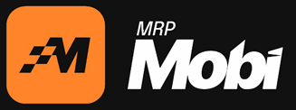

# 🚗 MRP Mobi - Landing Page de Indicação de Alta Conversão

> Landing Page premium desenvolvida no estilo **Startup Unicórnio** (inspirada em Stripe, Linear, Framer e Vercel) focada na conversão de cadastros e captação de usuários para a **MRP Mobi** através do link de indicação exclusivo.



---

## ⚡ Recursos & Destaques

- **Visual Premium Unicorn/Dark Theme**: Estilização moderna com paleta oficial MRP Mobi (`#FF6B00`), espaço em branco generoso, glassmorphism e sombras neon.
- **Foco Absoluto em Conversão**: Chamadas para ação (CTAs) estrategicamente distribuídas na Navbar, Hero, Barra de Garantias, Benefícios, Carrossel, QR Code e Footer, todas apontando para o link oficial de cadastro (`https://convite.mrpmobi.com.br/register/1062`).
- **Carrossel Interativo de 6 Pilares**:
  - Mercado Bilionário de R$ 10B no Brasil
  - Múltiplas Categorias em Um Só App (Corridas, Delivery, Fretes, Mudanças, Pet, Guincho)
  - Saques Instantâneos via PIX
  - Benefícios aos Passageiros
  - Repasse Justo de 79% aos Motoristas
  - Comissões Recorrentes Vitalícias
  - *Auto-play inteligente com reinício do temporizador ao interagir*.
- **Scroll Reveal Hero Animation**: Aparição fluida e suave do carro no Hero ao rolar a página.
- **QR Code Oficial & Copiador de Link**: QR Code verificado para escaneamento rápido via celular e botão para cópia do link com 1 clique.
- **SEO de Alta Performance**: Metadados completos para Open Graph, Twitter Cards, dados estruturados Schema.org (JSON-LD), `sitemap.ts` e `robots.ts`.
- **100% Interno & Sem APIs Externas**: Código limpo, veloz, sem dependências externas ocultas e com carregamento instantâneo.

---

## 🛠️ Tecnologias Utilizadas

- **Core**: [Next.js 15 (App Router)](https://nextjs.org/) + [React 19](https://react.dev/) + [TypeScript](https://www.typescriptlang.org/)
- **Estilização**: [TailwindCSS v4](https://tailwindcss.com/)
- **Animações & Motion**: [Framer Motion](https://www.framer-[#FF6B00]motion.com/)
- **Ícones**: [Lucide React](https://lucide.dev/)
- **Otimização de Imagens & Fontes**: `next/image` & `next/font` (Plus Jakarta Sans)

---

## 🚀 Como Executar o Projeto Localmente

### Pré-requisitos
- **Node.js**: v18.0.0 ou superior
- **npm**: v9.0.0 ou superior

### Passos para execução:

1. **Clonar o repositório:**
   ```bash
   git clone https://github.com/XkrulesVitor/MRP-Mobi.git
   cd MRP-Mobi
   ```

2. **Instalar as dependências:**
   ```bash
   npm install
   ```

3. **Iniciar o servidor de desenvolvimento:**
   ```bash
   npm run dev
   ```
   Acesse no seu navegador: `http://localhost:3000`

4. **Gerar a versão de produção (Build):**
   ```bash
   npm run build
   ```

---

## 📂 Estrutura do Projeto

```text
MRP_mobi/
├── app/
│   ├── favicon.ico
│   ├── globals.css
│   ├── layout.tsx
│   ├── page.tsx
│   ├── robots.ts
│   └── sitemap.ts
├── components/
│   ├── ui/
│   │   └── CTAButton.tsx
│   ├── Navbar.tsx
│   ├── Hero.tsx
│   ├── TrustBar.tsx
│   ├── HowItWorksTimeline.tsx
│   ├── Benefits3D.tsx
│   ├── FeaturesCarousel.tsx
│   ├── AboutCompany.tsx
│   ├── QRCodeCTA.tsx
│   ├── Footer.tsx
│   ├── StickyMobileCTA.tsx
│   ├── AnimatedBackground.tsx
│   └── FloatingCards.tsx
├── lib/
│   ├── constants.ts
│   └── utils.ts
└── public/
    ├── QRcode.png
    ├── cropped-logo-novo-recorte-mrp.png
    ├── favicon.png
    ├── mrp-cel-1-576x1024.png
    ├── carro-mobi-recort.fw_-2048x761.png
    └── slide_*.jpg
```

---

## 📜 Licença

Desenvolvido para **MRP Mobi**. Todos os direitos reservados.
